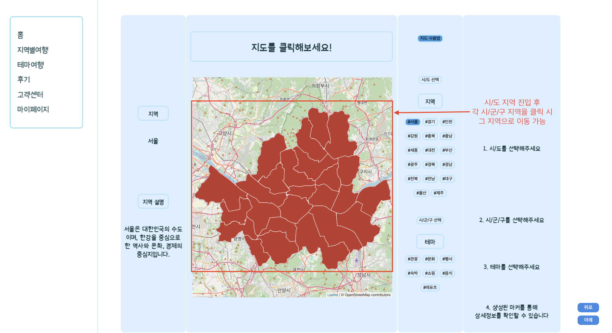
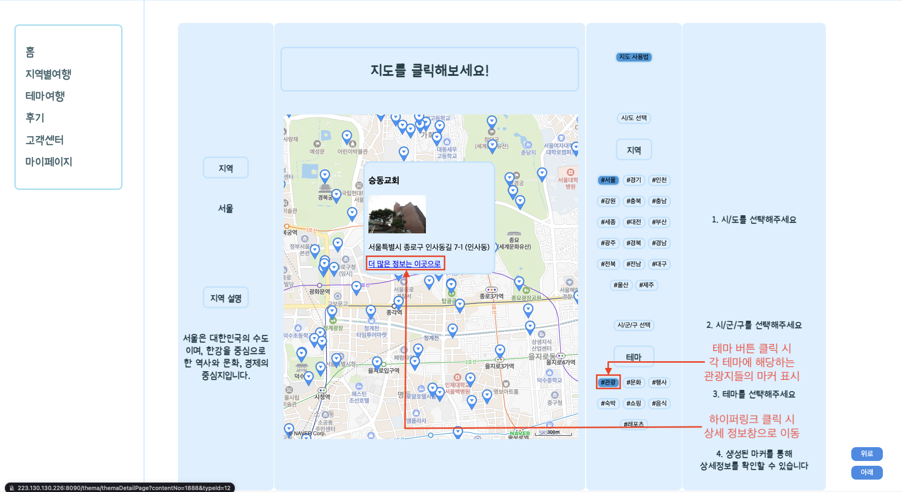
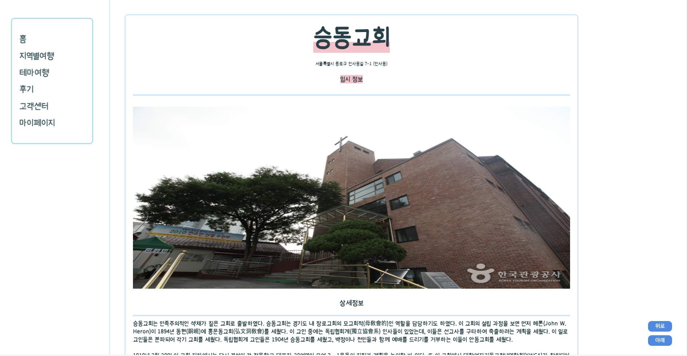
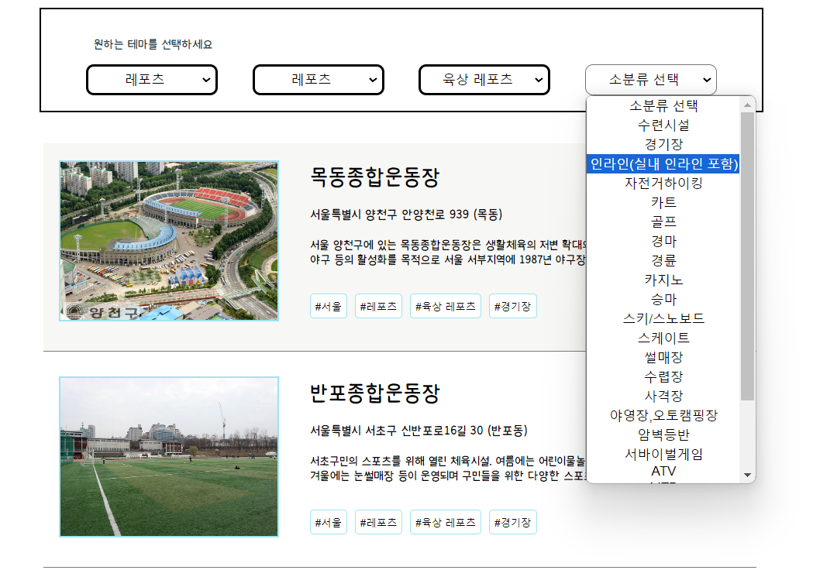
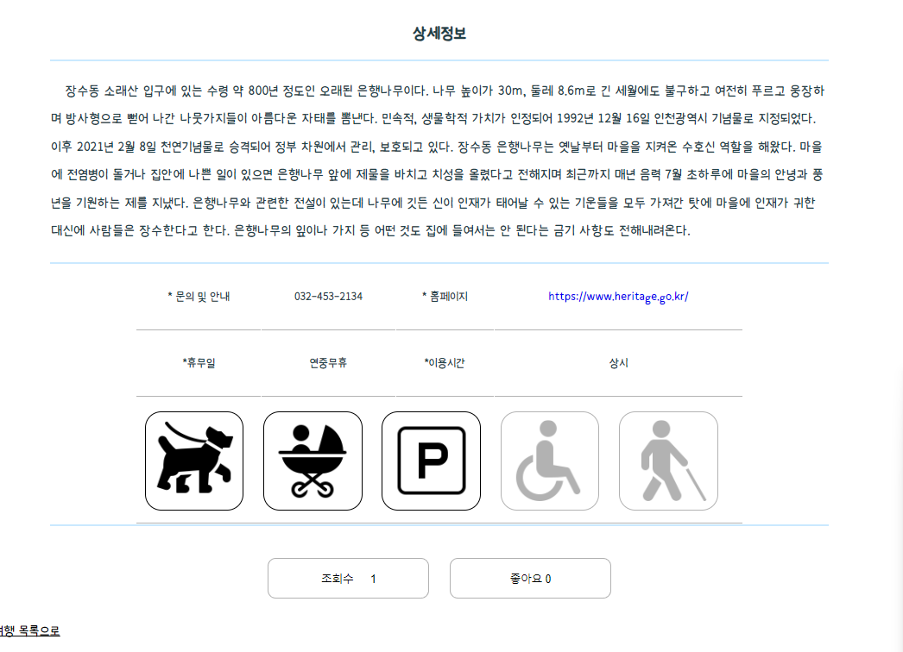
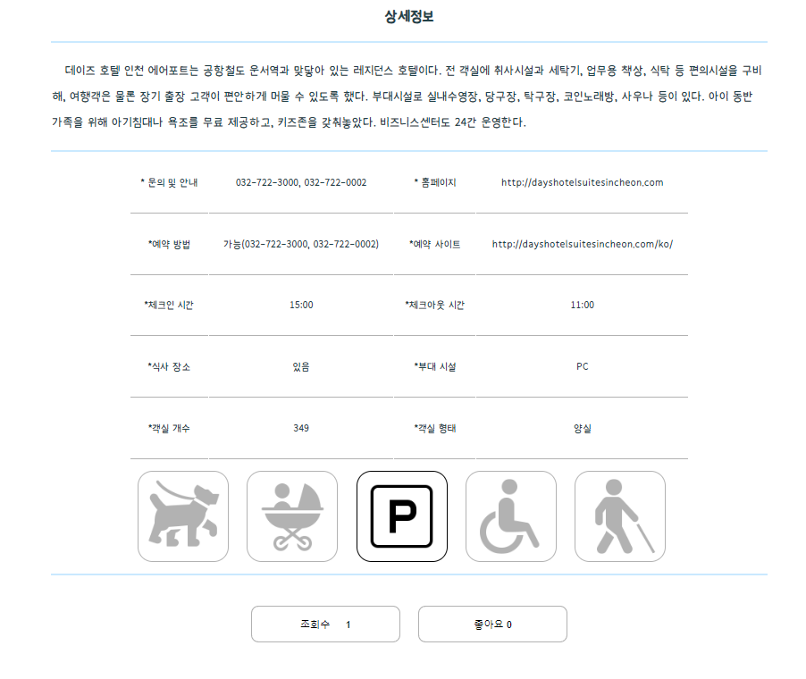
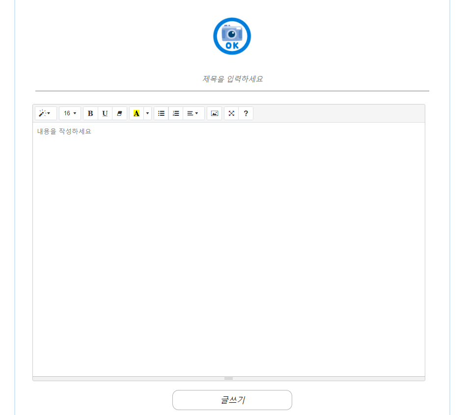
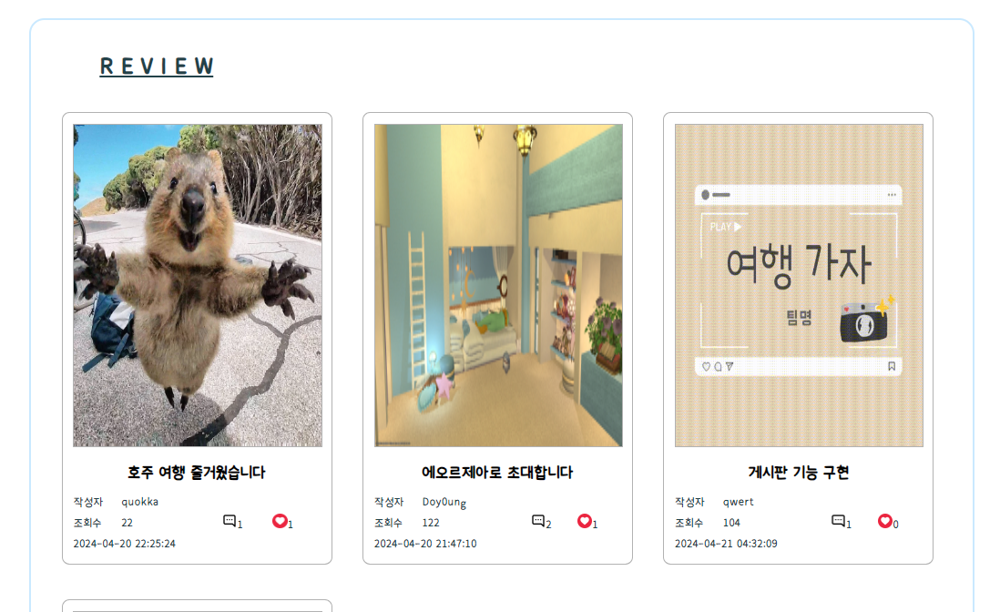
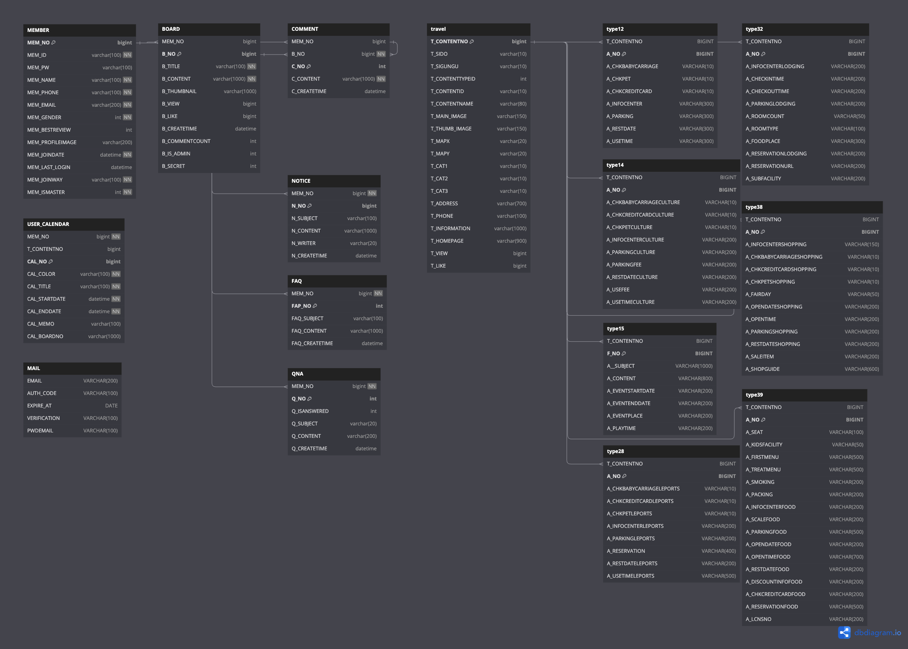
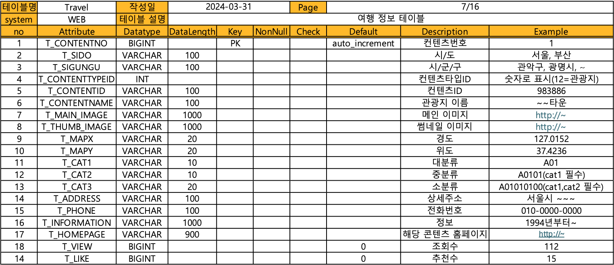

# 국내 관광지 소개 웹페이지, 나들이

-----------------

<p align="center">
    
    <sup><a href="http:/223.130.130.226:8090/" target="_blank">Nadeuli 메인페이지</a></sup>
</p>

-----------------

## 목차
1. [개요](#개요)
2. [개발자소개](#개발자소개)
2. [설계의 주안점](#설계의-주안점)
3. [주요기능](#주요기능)
4. [개발환경](#개발환경)
5. [개발기간 및 스케줄](#개발기간-및-스케줄)
4. [문서](#문서)
-----------------

## 개요

- **나들이**는 국내 관광지를 소개하고, 사용자들이 관광지를 탐색하고 리뷰를 작성할 수 있는 웹페이지입니다.

-----------------

## 개발자소개
<table>
    <tr>
        <th align="center" style="color: whitesmoke">이름</th>
        <th align="center" style="color: whitesmoke" width=200px;>이예지</th>
        <th align="center" style="color: whitesmoke" width=200px;>이훈민</th>
        <th align="center" style="color: whitesmoke" width=200px;>정용철</th>
        <th align="center" style="color: whitesmoke" width=200px;>최인환</th>
        <th align="center" style="color: whitesmoke" width=200px;>김재원</th>
    </tr>
    <tr>
        <th align="center" style="color: whitesmoke">사진</th>
        <td align="center"> </td>
        <td align="center"></td>
        <td align="center"></td>
        <td align="center"></td>
        <td align="center"></td>
    </tr>
    <tr>
        <th align="center" style="color: whitesmoke">역할</th>
        <td align="center"><strong style="color: white">프론트엔드</strong>
                                <br>마이페이지/캘린더
                                <br><strong style="color: white">백엔드</strong>
                                <br>마이페이지/캘린더
                                <br>메인페이지(도표)
        </td>
        <td align="center"><strong style="color: white">프론트엔드</strong>
                                <br>상세정보/후기/테마 페이지
                                <br><strong style="color: white">백엔드</strong>
                                <br>DB설계<br>상세정보/후기, 테마
        </td>
        <td align="center"><strong style="color: white">프론트엔드</strong>
                                <br>메인페이지<br>공지/QnA,FnA 페이지
                                <br><strong style="color: white">백엔드</strong>
                                <br>공지/QnA/FnA
        </td>
        <td align="center"><strong style="color: white">프론트엔드</strong>
                                <br>로그인/로그아웃, 회원가입 페이지
                                <br><strong style="color: white">백엔드</strong>
                                <br>로그인/로그아웃, 회원가입<br>소셜로그인 연동
        </td>
        <td align="center"><strong style="color: white">프론트엔드</strong>
                                <br>지도 페이지
                                <br><strong style="color: white">백엔드</strong>
                                <br>DB설계, 지도
                                <br>메인(추천여행지)
        </td>
    </tr>
    <tr>
        <th align="center" style="color: whitesmoke">프로필</th>
        <td align="center"><a href="https://github.com/leeyehji" >깃허브</a></td>
        <td align="center"><a href="https://github.com/cuscus8">깃허브</a></td>
        <td align="center"><a href="https://github.com/jyc961020">깃허브</a></td>
        <td align="center"><a href="https://github.com/Choiinhwan11">깃허브</a></td>
        <td align="center"><a href="https://github.com/UsoD98">깃허브</a></td>
    </tr>
</table>

-----------------

## 설계의 주안점

- 정보 제공 사이트에 맞춰 다양한 여행 정보와 기능을 제공하기 위해 노력했습니다.

1. 웹페이지를 이용한 간편한 회원가입 / 로그인 시스템
2. HTML, CSS, jQuery를 이용한 사용자가 이해하기 쉬운 UI구성
3. HTML을 이용한 각각의 페이지 프레임 구성
4. SPRING MVC를 통한 게시판 및 홈페이지 구성
5. AJAX를 이용한 테이블(화면전환) 처리
6. 다양한 API 활용(지도, 차트, 캘린더, 소셜로그인, 공공데이터)

-----------------

## 주요기능

- <h3>네이버 지도와 공공데이터를 활용한 관광지 탐색 기능</h3>
<p align="center">
    
    <sup style="color:#0AC5A8; font-weight: bolder;">- 여행지 안내문 -</sup>
</p>
<p align="center">
    
    <sup style="color:#0AC5A8; font-weight: bolder;">- 서울 지도 -</sup>
</p>
<p align="center">
    
    <sup style="color:#0AC5A8; font-weight: bolder;">- 각 테마 클릭에 따른 마커/정보창 표시 -</sup>
</p>
<p align="center">
    
    <sup style="color:#0AC5A8; font-weight: bolder;">- 정보창에서 이동 가능한 상세 정보창 -</sup>
</p>

- <h3>테마 태그를 이용한 관광지 탐색 기능</h3>
<p>DB에 저장된 TOUR API의 관광지 정보를 사용자의 태그선택에 따라 출력</p>
<p align="center">
    
    <sup style="color:#0AC5A8; font-weight: bolder;">- 7가지 테마에 따른 각기 다른 정보 출력 -</sup>
</p>
<p align="center">
    <br>
    <br>
    <sup style="color:#0AC5A8; font-weight: bolder;">- 테마 검색 결과에서 이동 가능한 상세 정보창 -</sup>
</p>

- <h3>사용자 편의성과 심미성을 갖춘 리뷰 작성 기능</h3>
<p align="center">
    <br>
    <sup style="color:#0AC5A8; font-weight: bolder;">- wizwig 에디터를 이용한 리뷰 작성 -</sup>
</p>
<p align="center">
    
    <sup style="color:#0AC5A8; font-weight: bolder;">- NCP Object Storage를 활용하여 사용자의 File을 저장, 후기 리스트 출력 -</sup>
</p>

- <h3>사용자 전용 캘린더 기능</h3>

-----------------

## 개발환경

### 프론트엔드
- HTML
- CSS
- JavaScript
- jQuery
### 백엔드
- Java 17, Servlet, Spring 5 , MyBatis
### 라이브러리
- Lombok, JSTL, JSP, Leaflet
### 데이터베이스
- MySQL, NCP Cloud DB for MySQL
### 운영체제
- Windows, macOS, NCP - Ubuntu 20.04
### 서버
- Apache Tomcat 9
### 빌드 / 배포 및 CI / CD
- Naver Cloud Platform, Maven, Git , Docker , Jenkins
### 개발 도구
- Eclipse, STS, IntelliJ, MySQL Workbench
### API
- Naver Map API, Naver Login API, Naver Calendar API, Google Email API, Tour API (한국관광공사)
### 커뮤니케이션 도구
- Notion, GitHub, KakaoTalk, Discord
### 기타
- NCP Cloud Storage

-----------------


## 개발기간 및 스케줄

- 2024.03.29 ~ 2024.04.21

```
<여기에 개발 일정 사진 넣을 예정>
```

-----------------

## 문서

### **디렉토리 구조**

<p>스프링 디렉토리 구조는 크게 계층형과 도메인 구조로 나눌 수 있습니다.</p> <p>계층형은 프로젝트의 이해도가 낮더라도 전체적인 구조를 빠르게 파악할 수 있다는 장점이 있습니다.</p> <p>하지만 한 디렉토리 내에 너무 많은 클래스가 들어가 세부적인 구조를 파악하기는 불편합니다.</p> <p>따라서 해당 프로젝트에서는 **도메인 구조**를 활용하였습니다.</p> <p>프로젝트에 대한 이해도가 충분하다면 계층형보다 빠르고 쉽게 구조를 파악할 수 있습니다.</p> <p>구체적인 구조는 다음과 같습니다.</p>
<p align="center">
    
    <sup style="color:#0AC5A8; font-weight: bolder;">- 도메인 구조 -</sup>
</p>

### **2.FLOWCHART**

<p>애플리케이션의 전체적인 흐름을 나타내는 FLOWCHART입니다. 사용자의 요청을 받아 처리하는 과정과 데이터베이스와의 상호작용을 시각적으로 표현하였습니다.</p>
<p align="center">
    
    <sup style="color:#0AC5A8; font-weight: bolder;">- FLOWCHART -</sup>
</p>

### **DB Diagram**
<p>사용한 데이터베이스는 MySQL 데이터베이스이며, 네이버 클라우드 플랫폼을 이용하여 MySQL 데이터 베이스를 만들어 유저 정보, 관광지 정보 등을 저장하였습니다.</p>
<p>데이터 베이스는 엑셀 및 DB diagram을 만들어 각 테이블의 구조를 직관적으로 확인할 수 있도록 하였습니다.</p>
<p align="center">
    
    <sup style="color:#0AC5A8; font-weight: bolder;">- DB Diagram -</sup>
</p>

### **4.테이블 정의서**

<p>데이터베이스의 각 테이블에 대한 정의서입니다. 테이블 명칭, 컬럼명, 데이터 타입, 제약조건 등의 정보를 상세히 기술하였습니다.</p>
<p align="center">
    
    
    <sup style="color:#0AC5A8; font-weight: bolder;">- DB Table Def -</sup>
</p>

### **5.클래스 Diagram**

<p>애플리케이션의 클래스 구조를 나타내는 다이어그램입니다. 각 클래스 간의 관계와 메서드, 속성 등을 시각적으로 표현하였습니다.</p>
<p align="center">
    
    <sup style="color:#0AC5A8; font-weight: bolder;">- Class Diagram -</sup>
</p>
